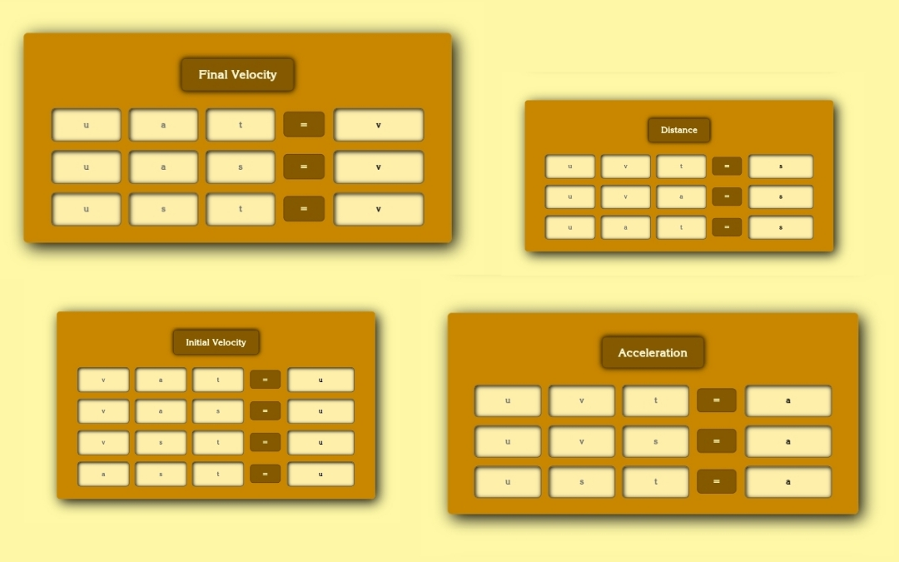

<!-- PROJECT INTRO -->

  

  <h1> Motion Calculator </h1>

  <h3> This is a Essential Calculator for Physic's Dynamics </h3>
  

    <a href="https://abdullahab120.github.io/Motion-Calculator"> View Demo </a>
    ·
    <a href="https://github.com/AbdullahAB120/Motion-Calculator/issues/new?labels=bug&template=bug-report---.md"> Report Bug </a>
    ·
    <a href="https://github.com/AbdullahAB120/Motion-Calculator/issues/new?labels=enhancement&template=feature-request---.md"> Request Feature </a>
  

 
 

<!-- ABOUT THE PROJECT -->
## About The Project

This is a essential calculator for physic's dynamics, named Motion Calculator. When I have completed Javascript after HTML, CSS & Bootstarp, I made this project for practise purpose. I made this project with HTML, CSS & Javascript. So this is a functional project. Also it is a dynamic website, not a static website. And it is a creative work for me. Because this project's GUI and Functionality was totally my own idea. However, you can contact with me for more information. Thank you for visiting my github repo...!

Symbol's Meaning of this Project :
* u - Initial Velocity
* v - Velocity
* a - Accelaration
* s - Distance
* t - Time

 
 

<!-- HOW To USE This PROJECT -->
## How to use

* At first, decide which value you don't know...
* Suppose you don't know velocity's value. Now you want to take out of velocity's value.
* To take out the velocity's value, You must know the other at least two value of (u,a,s,t). Suppose you know u & a.
* Then back to go Velocity's Form in this project and find the exect input field where you can input u & a's value
* Input u & a's value and hit '=' symbol
* Great...! You get to know the velocity's value

 
 

<!-- BUILT WITH -->
## Built With

 
 
 
 
 
 

 
 
<!-- CONTRIBUTING -->
## Contributing

Contributions are what make the open source community such an amazing place to learn, inspire, and create. Any contributions you make are **greatly appreciated**.

If you have a suggestion that would make this better, please fork the repo and create a pull request. You can also simply open an issue with the tag "enhancement".
Don't forget to give the project a star! Thanks again!

1. Fork the Project
2. Create your Feature Branch (`git checkout -b feature/AmazingFeature`)
3. Commit your Changes (`git commit -m 'Add some AmazingFeature'`)
4. Push to the Branch (`git push origin feature/AmazingFeature`)
5. Open a Pull Request

 
 

<!-- LICENSE -->
## License

Distributed under the MIT License. See `LICENSE.txt` for more information.

 
 

<!-- CONTACT -->
## Contact 

<a href="https://www.facebook.com/AbdullahAB120"> Facebook </a>
·
<a href="https://www.instagram.com/AbdullahAB_120"> Instagram </a>
·
<a href="https://www.linkedin.com/in/AbdullahAB120"> LinkedIn </a>
·
<a href="https://www.x.com/AbdullahAB120"> Twitter </a>
·
<a href="https://www.fiver.com/AbdullahAB120"> Fiverr </a>